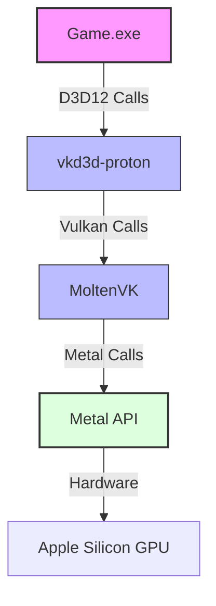
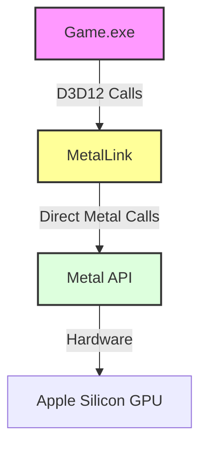

# MetalLink: D3D12 → Metal Translation Layer for macOS

> **Project Code Name**: MetalLink  
> **Target Platform**: macOS 14.0+ (Apple Silicon M1/M2/M3/M4/M5)  
> **Objective**: Replace the high-overhead translation stack (vkd3d-proton → MoltenVK → Metal) with a direct, optimized, and shippable D3D12-to-Metal translation layer.

---

## 1. Architectural Overview

Traditional Windows game translation on macOS runs through a four-layer stack, introducing significant overhead, driver bugs, and latency:



**MetalLink** bypasses the Vulkan middle layers, offering a direct pathway to Metal designed from the ground up to exploit Apple Silicon features:



### Key Structural Advantages
1. **Reduced Call Overhead**: Fewer abstraction layers mean significantly lower CPU overhead during command buffer recording.
2. **Direct Concept Mapping**: D3D12 and Metal were developed in the same era (2014–2015) and share an identical modern GPU pipeline mental model (explicit synchronization, command lists, pipeline state compilation).
3. **Unified Memory Optimizations**: Zero-copy buffers instead of redundant VRAM staging copies.
4. **License Compatibility**: Completely open-source and shippable in commercial macOS packages, unlike Apple's proprietary `D3DMetal` from the Game Porting Toolkit (GPTK).

---

## 2. API Mapping & Core Systems

### 2.1 Object Mapping Reference

| D3D12 API Object | Metal API Equivalent | Translation Type | Notes / Complexity |
| :--- | :--- | :--- | :--- |
| `ID3D12Device` | `id<MTLDevice>` | Direct | Trivial wrapper creation. |
| `ID3D12CommandQueue` | `id<MTLCommandQueue>` | Direct | Maps queue priorities directly. |
| `ID3D12CommandAllocator` | Internal allocation pool | Managed | We maintain our own pool of reuseable `id<MTLCommandBuffer>` instances. |
| `ID3D12GraphicsCommandList` | `id<MTLCommandBuffer>` + Encoders | Complex | Must track state changes and instantiate/end `id<MTLRenderCommandEncoder>` or `id<MTLComputeCommandEncoder>` as needed. |
| `ID3D12Resource` (Buffers) | `id<MTLBuffer>` | Direct | Standard memory mapping. |
| `ID3D12Resource` (Textures) | `id<MTLTexture>` | Direct | Layout translation handled via format mappings. |
| `ID3D12DescriptorHeap` | Metal Argument Buffers / Bindless | Complex | Maps descriptor tables to Argument Buffers (Metal 3). |
| `ID3D12RootSignature` | Metal Argument Table layout | Managed | Pre-calculates argument encoder sizes and binds them dynamically. |
| `ID3D12PipelineState` | `id<MTLRenderPipelineState>` | Direct | Compiled from translated MSL. |
| `ID3D12Fence` | `id<MTLEvent>` / `id<MTLSharedEvent>` | Direct | Maps to command buffer wait/signal events. |
| `IDXGISwapChain` | `CAMetalLayer` + Cocoa Window | Direct | Traditional macOS presentation. |

---

## 3. High-Performance Optimization Strategies

### 3.1 Unified Memory Superpower
On standard Windows PCs with discrete GPUs, transferring resources requires a redundant staging step:
1. CPU writes to host-visible memory (`D3D12_HEAP_TYPE_UPLOAD`).
2. Driver issues a copy command (`CopyTextureRegion` / `CopyBufferRegion`).
3. GPU reads from dedicated high-speed VRAM (`D3D12_HEAP_TYPE_DEFAULT`).

On Apple Silicon's Unified Memory Architecture (UMA), the CPU and GPU share the same physical memory space. MetalLink exploits this by mapping D3D12 heaps directly to Metal resource modes:

```
[Windows Memory Model]
CPU RAM (Upload Heap) ---> [PCIe Copy] ---> GPU VRAM (Default Heap)

[MetalLink UMA Model]
CPU RAM / GPU VRAM (Shared Allocation)
  └── Shared physical address space. No PCIe copy required.
```

> [!TIP]
> **Zero-Copy Optimization**: For `D3D12_HEAP_TYPE_UPLOAD` resources that are read frequently by the GPU, MetalLink can assign `MTLStorageModeShared`. Rather than allocating a separate `MTLStorageModePrivate` buffer and copying, we simply point both D3D12 resource handles to the same underlying physical allocation. This cuts VRAM usage by up to 50% for high-frequency resource streaming (e.g., virtual texturing, mesh streaming).

### 3.2 Shader Translation Pipeline
We avoid the convoluted DXIL → SPIR-V → MSL translation path (used by vkd3d + MoltenVK), which frequently suffers from performance loss, incorrect scalar casting, and shader compiler crashes.

Instead, we leverage **Apple's Metal Shader Converter (MSC)**:
* Windows games ship with pre-compiled **DXIL** (DirectX Intermediate Language) shaders.
* MetalLink intercepts PSO creation (`CreateGraphicsPipelineState`).
* The compiled DXIL shader bytecode is passed directly to the Metal Shader Converter library (`libmetal_shader_converter.dylib` or `metal-tt` CLI tool).
* MSC emits native **MSL** (Metal Shading Language) or compiled `.metallib` binary libraries.
* The generated bytecode is directly loaded into the pipeline using `newRenderPipelineStateWithDescriptor:error:`.

```
Traditional:  DXIL ---> SPIR-V ---> MSL ---> Native Metal (High fail rate)
MetalLink:    DXIL ────────────────────────> MSL / Metallib (Direct & stable)
```

### 3.3 Descriptor Heap Emulation via Metal 3 Argument Buffers
D3D12 games bind resources using descriptor heaps (CBV, SRV, UAV, Sampler) referenced by a Root Signature.
* MetalLink represents the Root Signature as a set of Metal 3 **Argument Buffers**.
* We define a structured buffer layout where each entry corresponds to a D3D12 descriptor.
* When the game calls `SetGraphicsRootDescriptorTable`, MetalLink encodes the resource handles (using `-[id<MTLArgumentEncoder> setBuffers:offsets:withRange:]`) directly into the active argument buffer.

---

## 4. Advanced Features & Extensions Roadmap

### 4.1 DirectX Raytracing (DXR) 1.0/1.1
Thanks to Apple Silicon's hardware updates, Ray Tracing is a highly feasible target on M3, M4, and M5 chips.

> [!NOTE]
> **Hardware RT Availability**:
> * **M1 / M2 Families**: Software emulation required (highly slow, using compute shaders to traverse BVH trees).
> * **M3 / M4 / M5 Families**: Dedicated fixed-function Ray Acceleration Units present on-die.

* **Acceleration Structures**: D3D12's Bottom-Level Acceleration Structure (BLAS) and Top-Level Acceleration Structure (TLAS) map directly to Metal's `MTLPrimitiveAccelerationStructure` and `MTLInstanceAccelerationStructure`.
* **Ray Dispatch**: D3D12 `DispatchRays` translates directly to `-[id<MTLComputeCommandEncoder> dispatchRaysWithDescriptor:]`.
* **Intersection Functions**: D3D12 shader tables map to `MTLIntersectionFunctionTable`.

### 4.2 Mesh Shading Pipeline
D3D12 introduced Amplification and Mesh shaders to replace the classic vertex/geometry pipeline.
* macOS 13.0+ introduced support for **Object Shaders** (Amplification equivalent) and **Mesh Shaders** in Metal.
* MetalLink wraps this using `MTLMeshRenderPipelineDescriptor`. The payload passed between the Amplification and Mesh stage maps directly to the threadgroup memory allocated via `MTLThreadgroupBinding`.

### 4.3 Variable Rate Shading (VRS)
* D3D12 allows dynamic shading rates per-draw, per-primitive, or via a screen-space image.
* Metal supports this via **Variable Rasterization Rate (VRR)**. MetalLink maps the VRS screen-space shading rate image directly to a `MTLRasterizationRateMap`.

### 4.4 MetalFX Upscaling (FSR2/DLSS Wrapper)
Most modern games require temporal upscaling to hit target framerates. Windows games do this by calling FSR2 (FidelityFX) or DLSS libraries.
* MetalLink intercepts FSR2 or DLSS API calls inside the game process.
* It routes the render targets, depth buffer, exposure, and motion vectors to Apple's native **MetalFX Temporal Scaler** (`MTLFXTemporalScaler`).
* This provides hardware-accelerated upscaling with Apple Silicon neural engine optimizations for free, without compiling the FSR2 source code.

---

## 5. Proposed Project Structure

```
MetalLink/
├── CMakeLists.txt              # Unified build system
├── Include/
│   ├── d3d12.h                 # Override headers mapping D3D12 interfaces
│   └── dxgi.h                  # DXGI override headers
├── Source/
│   ├── DXGI/
│   │   ├── MLSwapChain.mm      # DXGI Swapchain -> CAMetalLayer
│   │   └── MLFactory.mm        # DXGI Device/Adapter enumeration
│   ├── Core/
│   │   ├── MLDevice.mm         # ID3D12Device implementation
│   │   ├── MLCommandList.mm    # Command recording, state-tracking, and encoding
│   │   ├── MLCommandQueue.mm   # MTLCommandQueue & command execution
│   │   ├── MLResource.mm       # Resource management (Buffers & Textures)
│   │   ├── MLDescriptorHeap.mm # Argument buffers & descriptor updates
│   │   └── MLRootSignature.mm  # Root signature parsing & resource bindings
│   ├── Pipeline/
│   │   ├── MLPipelineState.mm  # PSO construction and validation
│   │   └── MLShaderCache.mm    # DXIL compilation via Metal Shader Converter
│   └── Extensions/
│       ├── MLRaytracing.mm     # DXR -> MTLAccelerationStructure mapping
│       ├── MLMeshShaders.mm    # Mesh shaders implementation
│       └── MLMetalFX.mm        # Direct FSR2/DLSS -> MetalFX temporal upscaler
```

---

## 6. Milestone Plan (Updated)

```
       M7/M8: Complex Sync & Hardware             M10: MSL Compilation
             (Completed)                             (Upcoming)
   ───────────────────●───────────────────────────────────●──────────────────►
                                    ●───────────────────────────────────●
                         M9: Zero-Copy Unified Memory         M11: Descriptor Heaps
                                 (Next Up)                        (Upcoming)
```

* **Milestones 1-6 (Completed)**
  Established DXGI Swapchains, Core Device mappings, Command Allocators, basic Pipeline states, and triangle rendering capabilities.
* **Milestone 7 & 8: Hardware Constraints & Complex Synchronization (Completed)**
  Implemented Apple Silicon Gen tracking (M1-M5), Shadow Layout State Machines, airtight Enhanced Barriers, and frame profiling timestamp queries.
* **Milestone 9: Unified Memory Optimizations (Zero-Copy) (Next)**
  Profile memory copies. Implement zero-copy mapping for `D3D12_HEAP_TYPE_UPLOAD` by exploiting Apple Silicon UMA via `MTLStorageModeShared`. This bypasses expensive PCIe staging copies entirely.
* **Milestone 10: Dynamic Shader Translation via MSC**
  Connect DXIL blobs directly to the Metal Shader Converter library to natively compile shader bytecodes into MSL at runtime, eliminating SPIR-V middlemen.
* **Milestone 11: Descriptor Heap Emulation**
  Implement proper bindless rendering by mapping D3D12 Root Signatures into Metal 3 Argument Buffers.
* **Milestone 12+: DXR & MetalFX**
  Map DirectX Raytracing (DXR) into `MTLAccelerationStructure` for M3/M4 hardware and bridge DLSS/FSR2 scaling to the native `MTLFXTemporalScaler`.
