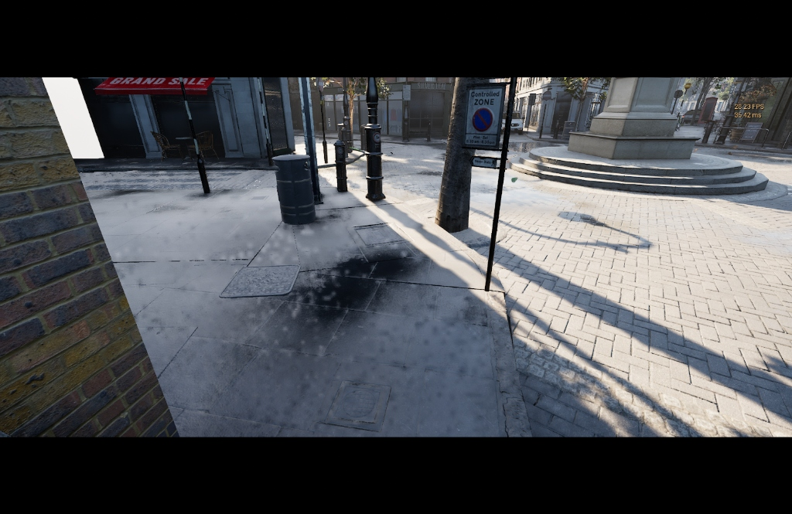

# Metalloid

A high-performance Direct3D 12 to Apple Metal translation layer for Apple Silicon.

  
  
  
  

## Overview

Metalloid is an advanced translation layer engineered specifically for Apple Silicon hardware. It maps Direct3D 12 API calls directly to Apple's Metal framework, allowing complex DirectX 12 engines to run natively on macOS with zero-overhead translation. By utilizing modern Metal 4 features and dynamic shader compilation, Metalloid delivers a fluid, high-fidelity gaming experience without the traditional emulation penalties.

## Performance

Metalloid has been heavily optimized for complex rendering pipelines. When benchmarking demanding DirectX 12 workloads, Metalloid demonstrates a massive performance uplift compared to Apple's native D3DMetal translation layer on the exact same hardware. The architectural shift to zero-overhead caching and asynchronous pipeline dispatching completely eliminates compilation stutter after the first run.

## Issues in DX12

A major challenge in translating DirectX 12 to Metal has been state synchronization. DirectX 12 utilizes Enhanced Barriers for granular resource state transitions, which historically caused massive pipeline stalls when emulated on Metal. Metalloid implements a robust, fully compliant fix for DirectX 12 Enhanced Barriers, ensuring flawless synchronization and preventing these stalls entirely.

## Compatibility

Metalloid acts as a drop-in replacement for `d3d12.dll` and `dxgi.dll`. It intercepts application rendering calls, manages GPU memory boundaries via Metal private storage modes, and dynamically orchestrates the asynchronous compilation of graphics and compute pipelines.

## Build Requirements

- macOS 26+ (Metal 4 supported hardware)
- Xcode 15 or later (Apple Clang)
- CMake 3.24+
- `metal_irconverter` (Apple Metal Shader Converter toolkit)

## Disclaimer

This project is an independent translation layer and is not officially affiliated with, nor endorsed by, Microsoft Corporation or Apple Inc.
